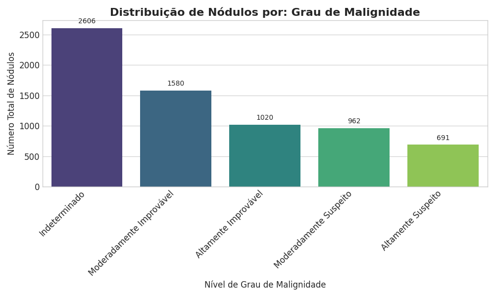
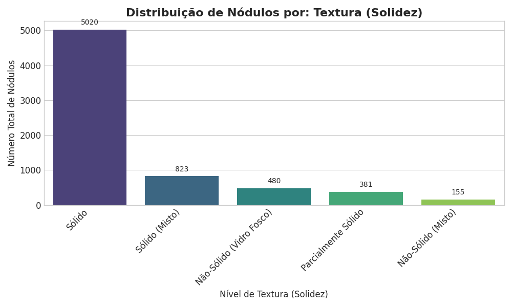
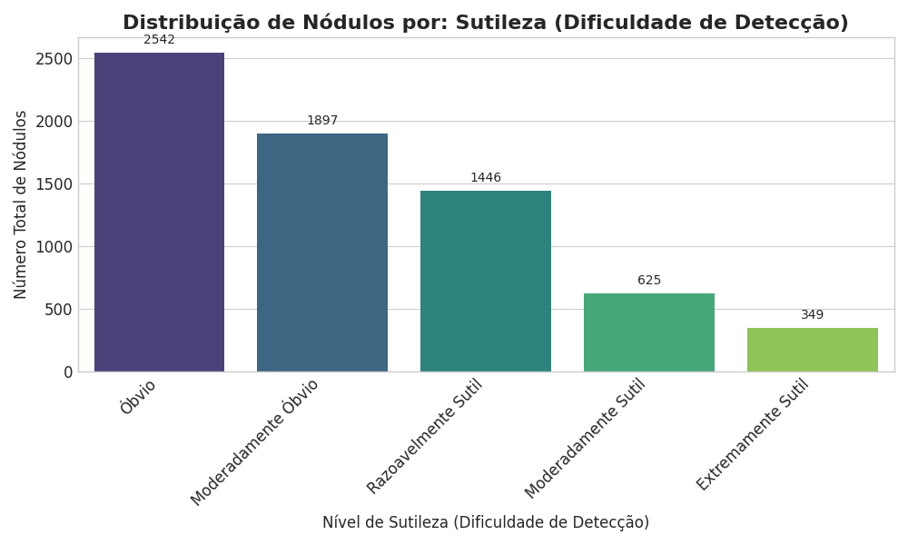
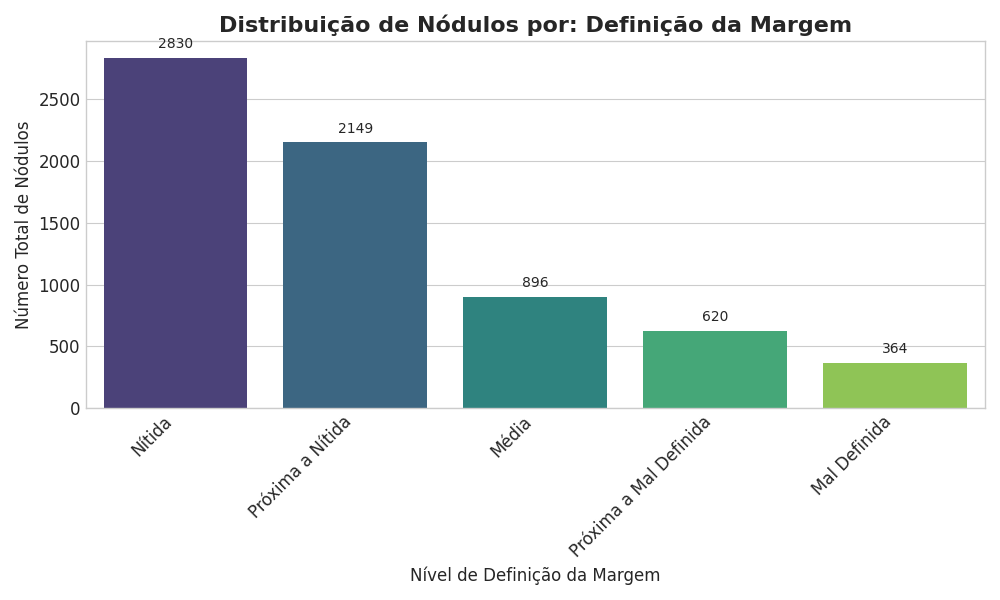
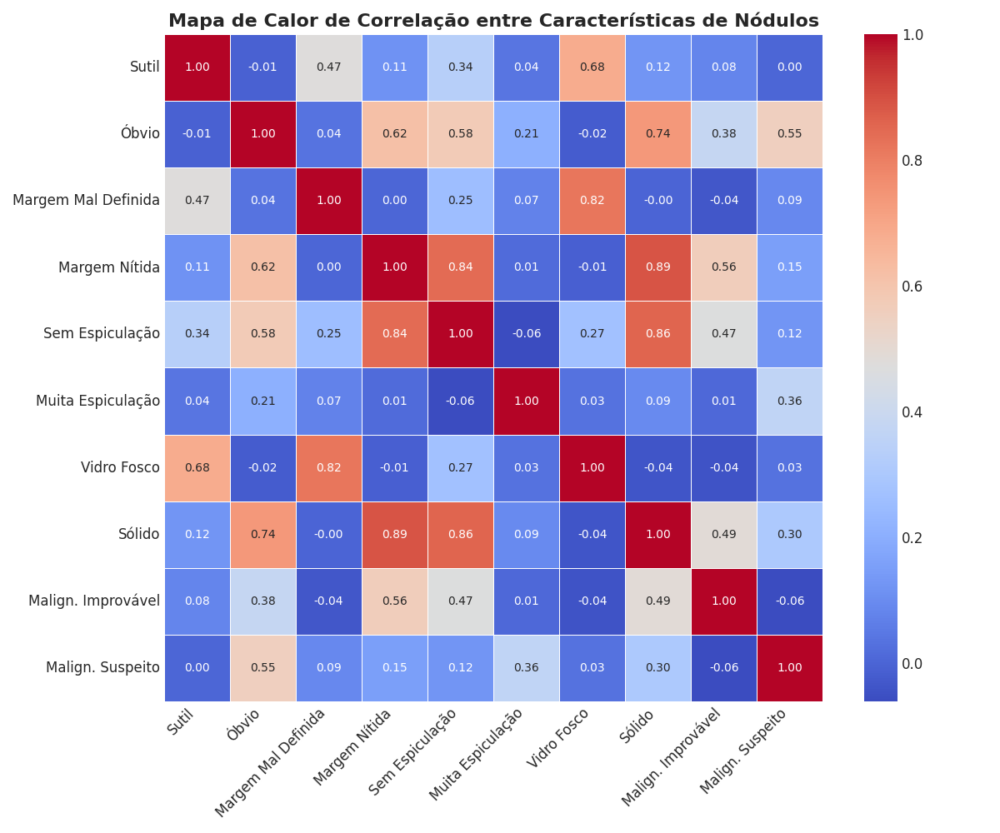

# Etapa 1: Ingestão e Análise de Qualidade de Dados (LIDC-IDRI)

**Status:** ✅ Concluído

Este diretório contém os scripts e resultados da primeira fase do projeto de detecção e segmentação de nódulos pulmonares. O objetivo desta etapa é:

1.  **Ingerir** de forma segura os dados do dataset LIDC-IDRI usando `pylidc`.
2.  **Executar um controle de qualidade (QC)** para lidar com metadados faltantes.
3.  **Gerar um perfil detalhado** de cada exame, enriquecendo os metadados com características detalhadas das anotações (malignidade, textura, etc.).
4.  **Analisar o perfil final** para extrair insights que guiarão as fases subsequentes do projeto.

## Ambiente e Instalação

1.  **Pré-requisito:** Python 3.9+
2.  Crie e ative um ambiente virtual:
    ```bash
    python -m venv venv
    source venv/bin/activate  # No Windows: venv\Scripts\activate
    ```
3.  Instale as dependências:
    ```bash
    pip install -r requirements.txt
    ```
4.  Configure o `pylidc` (execute apenas na primeira vez):
    ```bash
    pylidc-configure
    pylidc-download
    ```

**`requirements.txt`**

```text
pylidc==0.2.2
numpy<1.24
pandas==2.2.2
tqdm==4.66.4
matplotlib==3.8.4
seaborn==0.13.2
```

## Fluxo de Execução

Os scripts devem ser executados na seguinte ordem:

1.  **`ingestion_qc_v2.py`**: Realiza a varredura inicial do dataset, identifica todos os exames e trata metadados faltantes de forma segura.

    - **Entrada:** Dataset LIDC-IDRI (via `pylidc`).
    - **Saída:** `lidc_validated_patients_v2.csv` (um arquivo de metadados base).

2.  **`create_full_profile.py`**: Lê o arquivo de metadados base e o enriquece com a contagem detalhada de todas as características de cada nódulo (textura, sutileza, etc.).
    - **Entrada:** `lidc_validated_patients_v2.csv`.
    - **Saída:** `lidc_dataset_final_profile.csv` (o arquivo mestre para as próximas etapas).

## Análise do Dataset e Insights Chave

Após a execução dos scripts, realizamos uma análise exploratória profunda no arquivo `lidc_dataset_final_profile.csv`.

### Resumo Geral

- **Total de Exames (Scans):** 1018
- **Total de Pacientes Únicos:** 1010
- **Total de Nódulos Anotados:** **6.859**

### Distribuição das Características dos Nódulos

#### Grau de Malignidade



- **Insight:** O dataset é dominado por nódulos de malignidade "Indeterminada" (38%). Casos suspeitos (níveis 4 e 5) representam apenas 24.1%.
- **Implicação:** Há um forte desbalanceamento de classes. Estratégias como a **Focal Loss** e a avaliação por classes são essenciais.

#### Textura (Solidez)



- **Insight:** Quase três quartos (73.2%) de todos os nódulos são "Sólidos".
- **Implicação:** O modelo pode se tornar enviesado para nódulos sólidos. É crucial validar a performance separadamente em nódulos não-sólidos e de vidro fosco.

#### Sutileza (Dificuldade de Detecção)



- **Insight:** A maioria dos nódulos é "Óbvia" ou "Moderadamente Óbvia", mas existe uma cauda longa de mais de 900 nódulos (14.2%) considerados sutis.
- **Implicação:** Estes casos sutis representarão o maior desafio para os modelos de detecção e são os mais importantes para a validação da robustez do sistema.

#### Definição da Margem



- **Insight:** A maioria dos nódulos possui margens bem definidas, o que facilita a tarefa de segmentação.
- **Implicação:** O desempenho em nódulos com margens mal definidas (`margin` 1 e 2) será um diferencial importante entre as arquiteturas de segmentação.

### Correlações Clínicas nos Dados



- **Insight:** A análise de correlação confirma a coerência clínica do dataset.
  - ✅ **Forte Correlação Positiva:** Nódulos com `Margem Mal Definida` estão fortemente associados a `Vidro Fosco` (**r=0.82**).
  - ✅ **Confirmação Clínica:** A `Muita Espiculação` tem uma correlação positiva e relevante com o `Malign. Suspeito` (**r=0.36**).
  - ✅ **Consistência:** Nódulos `Sólidos` tendem a ter `Margem Nítida` (**r=0.89**) e serem mais `Óbvios` (**r=0.74**).

## Implicações Estratégicas e Próximos Passos

Esta análise aprofundada valida e informa a estratégia do projeto:

1.  **Necessidade de Lidar com Desbalanceamento:** As distribuições confirmam que funções de perda como a Focal Loss e amostragem estratificada são cruciais.
2.  **Avaliação Granular é Mandatória:** A performance dos modelos deve ser reportada não apenas de forma global, mas por subgrupos definidos por estas características (ex: performance em nódulos sutis, não-sólidos, etc.).
3.  **O Dataset é Clinicamente Válido:** As correlações confirmam que o dataset reflete o conhecimento clínico, tornando-o uma excelente base para treinar modelos de IA com relevância prática.

Com este perfil detalhado e validado, o projeto está pronto para a **Etapa 2: Pré-processamento**, onde estes metadados serão usados para carregar, recortar (crop) e normalizar os volumes de CT.
